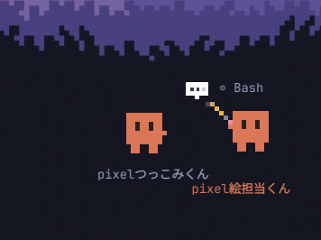

# CLAUDE GAGE 🦀

いま何匹のClaude Codeセッションが働いてるかを**飼育ケース(水槽)風に眺める**アプリ。

働いてる子は机で鉛筆カリカリ、待機中はうろうろ+キョロキョロ、
放置すると寝る→砂に埋まる→二枚貝。**セッション同士が会話(SendMessage)してると
お互いに歩み寄って向かい合い、間に💬が浮かぶ。**

## 3つの姿

| 形態 | 起動 | 説明 |
|---|---|---|
| Web水槽 | `./run.sh` (:8902) | フル機能。スマホ縦持ち対応(ゲージ高さドラッグ可変・設定タブ) |
| デスクトップ帯 | `./run-desktop.sh` | 透明ストリップに放牧。右クリックで世話メニュー |
| Android | WebViewラッパーAPK | Tailscale越しに外から眺める(このリポジトリ外) |

## データ源(プロセスを見ない)

`~/.claude/projects/**/<sessionId>.jsonl` のmtimeと末尾だけを読む:

- **状態**: 120秒以内に書込=working / 30分=idle / 2h=寝る / 24h=半埋まり / 7日=貝殻
- **タイトル**: `aiTitle` (手動命名 `names.json` が優先)
- **compact検出**: `compact_boundary` 行 → ✨スッキリ祝い(何k軽くなったか表示)
- **会話検出**: SendMessage tool_useの宛先を台帳(`~/.claude/sessions/`)で解決 → 寄り添いアニメ
- **サブエージェント**: `subagents/*.jsonl` → 子Clawdがヒヨコの行列でついて歩く

## 世話メニュー(右クリック/パネル)

- ✏ 名前を付ける(tmux窓名・kittyタブ名まで反映)
- 🖥 ターミナルで開く(貝殻は `claude --resume` で復活)
- 🗜 compactする(tmux send-keys / `kitten @ send-text` で注入)
- 💀 終了する

## 動作条件

- Python 3 標準ライブラリのみ(サーバ・デスクトップ共にpip不要。帯はPySide6が必要)
- tmux / kitty(リモコン有効: `allow_remote_control yes` + `listen_on unix:/tmp/mykitty-{kitty_pid}`)
- 改名ダイアログは `kdialog`(pip版PySide6はIMEが効かないため)

## 知見(ハマりどころ)

- Qt(xcb)は**カラー絵文字をQMenuでもQPainterでも描けない** → メニューアイコンは自前10x10ドット絵
- kittyタブに**手動タイトルが付いてると端末タイトルを無視し続ける** → 改名時に自動で剥がす
- シェル無しtmuxペインのCtrl+Z詰みは `kill -CONT <pid>` 一発で蘇生
